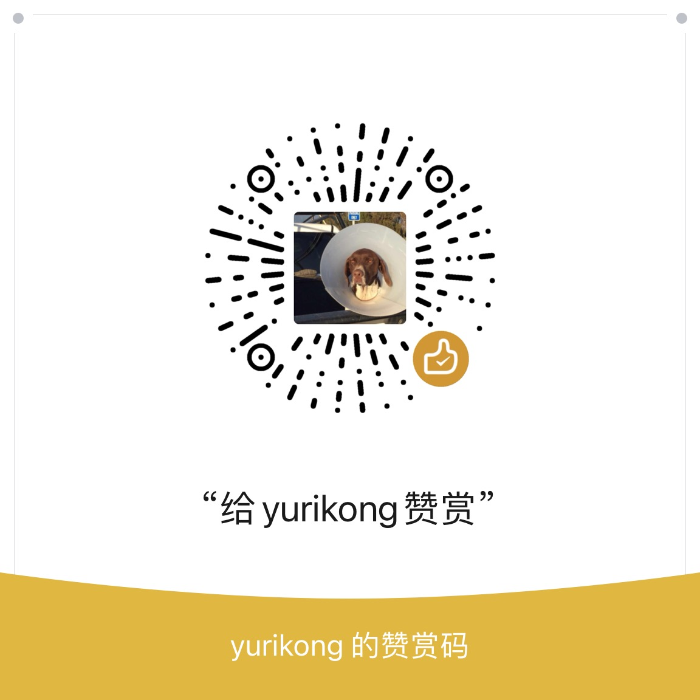

<p align="center">
 
</p>

<h3 align="center">Astro Resume Minimalist</h3>

<div align="center">


[](/LICENSE)

</div>

<div align="center">
<a href="./README.md">EN</a>
| <a href="./README_zh.md">ZH</a>
</div>

---

<p align="center">A minimalistic resume template site built with Astro.</p>

## 📝 Table of Contents

- [About](#about)
- [Features](#features)
- [Getting Started](#getting_started)
- [Usage](#usage)
- [Deployment](#deployment)
- [Built Using](#built_using)
- [Authors](#authors)
- [Acknowledgments](#acknowledgement)
- [Support](#support)

## 🧐 About <a id="about"></a>

The purpose of this project is to make a portfolio website to record and showcase my work and experiences throughout my career. This project finally came out after a few years of hunting down personal sites & resume templates, and postponements because of my personal affairs. Until recently, my experiences list seems to be long enough to get it started.

After seeing a lot of sites, I decided that it's an overkill to implement anything too fancy on a resume site, because it's the contents that matter. I want to put as much effort as possible to make it look like it's just enough. Nothing more, but nothing less. That is, a minimalistic feeling.

I believe this project is well suited for everyone, whether you are a fresh beginner or a seasoned veteran in the career. My own resume site extends from it. So let's give it a try!

## ✨ Features <a id="features"></a>

- support for `os` / `light` / `dark` color scheme
- support for internalization (`en` / `zh`)
- responsiveness design (tested on `Chrome` & `Safari` using Device Simulation, verified on iPhone 13 `Safari`)

## 🏁 Getting Started <a id="getting_started"></a>

These instructions will get you a copy of the project up and running on your local machine for development and testing purposes. See [deployment](#deployment) for notes on how to deploy the project on a live system.

### Prerequisites

- Node

### Installing

```bash
yarn
```

### Developing

```bash
yarn dev
```

## 🎈 Usage <a id="usage"></a>

- If you want to add more education/work/project experiences, go to `/src/data`
- If you want to add asset images, go to `/src/assets/images`
- If you want to add more routes, go to `/src/pages`
- Note that the codebase is enough to fulfill my requirements, you can of course always get rid of things and rewrite stuff tailored to your needs. You have full control over it.

## 🚀 Deployment <a id="deployment"></a>

- Github Pages

  - Make sure you change `site` and `base` of your project config (`astro.config.ts`), and all your links are pointing to the correct url.

  - You can build the project by running

    ```bash
    yarn build
    ```

  - You can verify the build by running

    ```bash
    yarn preview
    ```

  - After you build and preview the project, and verify that there are no errors, you are ready to ship, just merge to `main` branch, the github workflow will trigger and automatically deploy to github pages.

    ```bash
    git checkout main # from dev
    git merge dev
    git push
    ```

## ⛏️ Built Using <a id="built_using"></a>

- [Astro](https://astro.build/)
- [UnoCSS](https://unocss.dev/)

## ✍️ Authors <a id="authors"></a>

- [@Jianqiang Du](https://github.com/yurikong)

## 🎉 Acknowledgements <a id="acknowledgement"></a>

- [@Brittany Chiang](https://brittanychiang.com)

## 💸 Support <a id="support"></a>

- Wechat

  

<br/>

- Buy me a coffee

  
